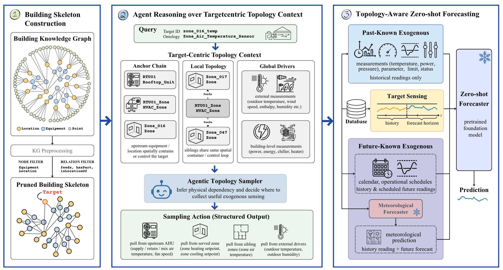
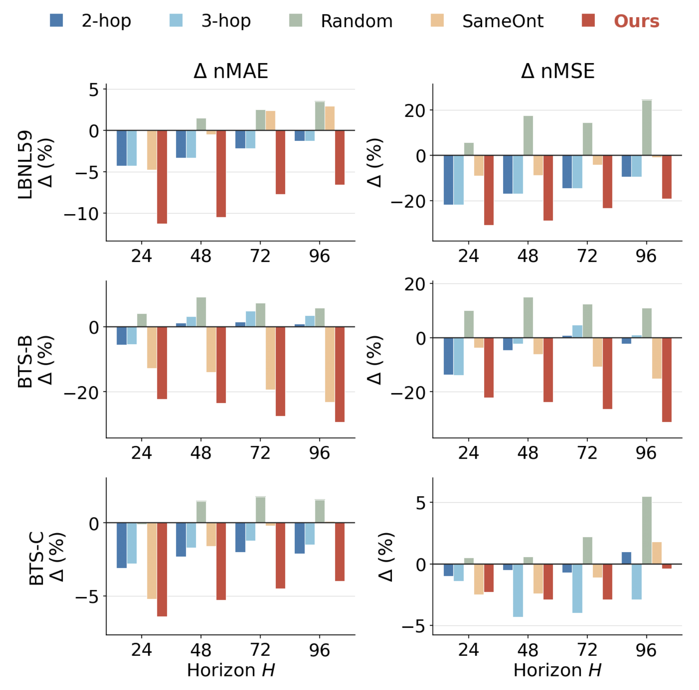
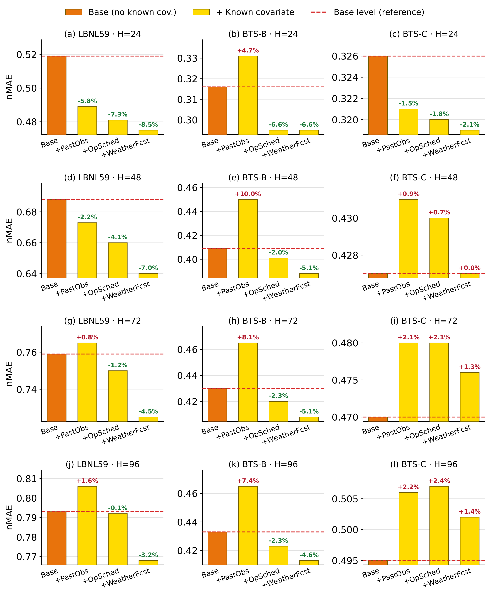
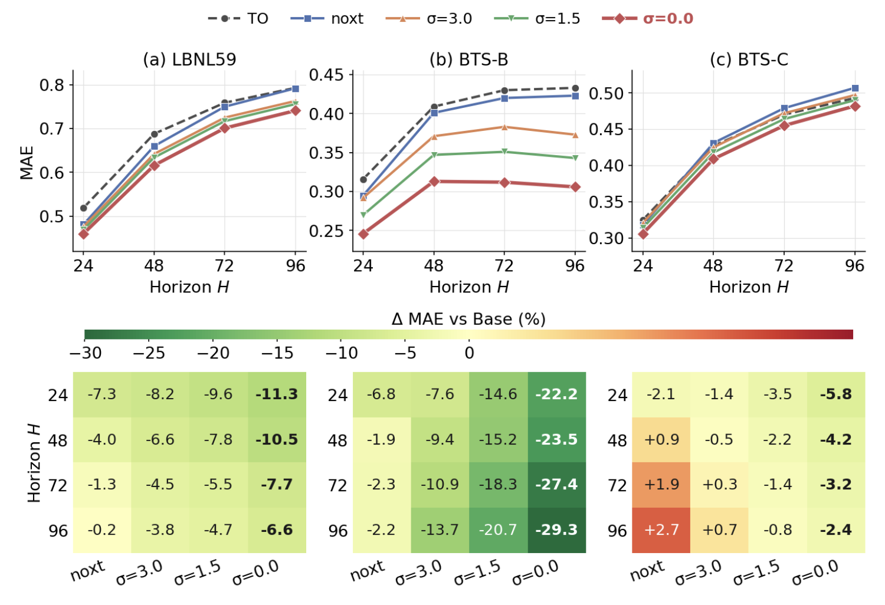

<h1 align="center">TopoBrick</h1>

  <b>Agentic Topology Sampling of Exogenous Variables for Zero-Shot Building IoT Forecasting</b>

  
  
  
  

  

---

## Overview

Modern buildings are dense cyber-physical systems with hundreds to thousands of sensing, control, and operational points. Each point is embedded in a physical topology, spatial hierarchy, and operational context — yet existing forecasters typically treat sensors as isolated series or condition on a fixed, pre-aligned covariate set.

**TopoBrick** is a *training-free* framework for zero-shot building IoT forecasting. Instead of training a per-building model or dumping every available signal into a foundation model, TopoBrick uses the **building knowledge graph** as a *routing layer*: an agentic topology sampler reasons over the building's structure to select a compact, target-specific set of exogenous variables, which are then organized by deployment-time availability and fed to a frozen time-series foundation model.

Across three real-world buildings on two continents, TopoBrick **outperforms strong zero-shot foundation-model baselines and remains competitive with fully trained building-specific models** — without any building-specific training.

---

## Highlights

- **Topology-aware exogenous-variable selection.** We reformulate zero-shot building forecasting as a variable-selection problem over a heterogeneous building KG, rather than a fixed multivariate setup.
- **Agentic topology sampler + KG-grounded verifier.** An LLM agent reasons over a compact building skeleton and emits structured sampling actions; a verifier audits every action against the KG before deterministic materialization.
- **Deployment-faithful availability split.** Selected variables are split into *past-known* (sensor / equipment states) and *future-known* (calendar, HVAC schedules, meteorological forecasts) — no future observations are leaked to the target task.
- **Fully training-free.** The foundation model is never fine-tuned. Only metadata-side computation is building-specific.
- **Consistent gains where physics is coupled.** Largest improvements on HVAC air-loop, water-loop, pressure, and weather-driven sensors.

---

## Pipeline

  

<i>Figure 1. TopoBrick pipeline: (1) building skeleton construction, (2) agentic reasoning over target-centric topology, (3) topology-aware zero-shot forecaster.</i>

The pipeline has three stages:

**1. Building Skeleton Construction.** The raw building KG is distilled into a compact skeleton that keeps `Equipment` and `Location` nodes plus structural relations (equipment flow, spatial containment, part-whole hierarchy), while Point leaves are stored as attachments rather than traversal targets. This prevents high-degree containers from expanding into unrelated Points.

**2. Agentic Topology Sampling.** For a target Point, we assemble a target-centric topology context — an *anchor*, its *local topology* (upstream / downstream / sibling / spatial), and *global drivers* (weather, building-level meters, schedules) — and render it as compact semantic text. An LLM agent then reasons about (i) which physical quantities drive the target, (ii) where in the skeleton those drivers live, and (iii) how far to expand. It outputs structured sampling actions `(anchor, scope, requested role)`. A KG-grounded verifier removes actions that are not supported by the skeleton, and a deterministic materializer expands the surviving actions into the final exogenous set `E(p)`.

**3. Topology-Aware Zero-Shot Forecasting.** The selected variables are split by availability. Past-known building signals cover the history window only; future-known calendar, schedule, and weather variables cover both history and horizon. A separate meteorological forecaster predicts weather over the horizon so no future weather is leaked. A frozen time-series foundation model then consumes `(target history, past-known, future-known)` and produces the forecast.

---

## Datasets

We evaluate on three real-world buildings, each with a semantic building KG and installed-sensor readings.

| Building | Location | # Target Points | Train | Val | Test |
|---|---|---:|---|---|---|
| **LBNL59** | UC Berkeley, USA | 103 | May–Jul 2020 | Aug 2020 | Sep–Oct 2020 |
| **BTS-B** | Australia | 57 | Nov 2021–Jan 2022 | Feb 2022 | Mar–Apr 2022 |
| **BTS-C** | Australia | 619 | Nov 2022–Jan 2023 | Feb 2023 | Mar–Apr 2023 |

Data is processed to 15-minute granularity. Historical context length `S = 96`, prediction horizons `H ∈ {24, 48, 72, 96}` (i.e., 6 h / 12 h / 18 h / 24 h ahead).

---

## Main Results

Normalized MAE / MSE across three buildings and four horizons. **Bold** = best overall, <u>underline</u> = second-best, shaded = best baseline. Lower is better.

| Method | H | LBNL59 nMAE | LBNL59 nMSE | BTS-B nMAE | BTS-B nMSE | BTS-C nMAE | BTS-C nMSE |
|---|---:|---:|---:|---:|---:|---:|---:|
| *Naive* |  |  |  |  |  |  |  |
| Persistence | 24 | 0.653 | 2.016 | 0.437 | 0.719 | 0.396 | 0.918 |
| Persistence | 96 | 1.075 | 4.320 | 0.731 | 1.066 | 0.708 | 1.471 |
| SNaive | 24 | 1.393 | 37.871 | 1.681 | 14.724 | 0.861 | 7.112 |
| SNaive | 96 | 1.033 | 11.713 | 0.656 | 2.829 | 0.646 | 2.546 |
| *Full-shot* |  |  |  |  |  |  |  |
| PatchTST | 24 | <u>0.478</u> | <u>1.119</u> | 0.379 | 0.744 | **0.319** | **0.611** |
| PatchTST | 96 | <u>0.757</u> | 2.403 | 0.765 | 3.628 | 0.504 | 0.700 |
| FITS | 24 | 0.505 | 1.288 | 0.342 | 0.455 | 0.352 | 0.620 |
| FITS | 96 | 0.775 | 2.515 | 0.619 | 0.769 | 0.499 | 0.674 |
| iTransformer | 24 | 0.481 | 1.188 | 0.347 | 0.613 | 0.323 | <u>0.582</u> |
| iTransformer | 96 | <u>0.757</u> | 2.429 | 1.155 | 2.573 | 0.503 | 0.690 |
| DLinear | 24 | 0.495 | 1.241 | 0.343 | 0.463 | 0.343 | 0.612 |
| DLinear | 96 | 0.753 | 2.423 | 0.641 | 0.861 | 0.504 | 0.700 |
| *Zero-shot* |  |  |  |  |  |  |  |
| Moirai 2.0 | 24 | 0.578 | 1.551 | 0.391 | 0.663 | 0.385 | 0.746 |
| Moirai 2.0 | 96 | 0.953 | 3.164 | 0.623 | 0.853 | 0.648 | 1.201 |
| TimesFM 2.0 | 24 | 0.546 | 1.543 | 0.360 | 0.558 | 0.359 | 0.648 |
| TimesFM 2.0 | 96 | 0.917 | 3.406 | 0.567 | 0.806 | 0.615 | 1.135 |
| Chronos-2 | 24 | 0.519 | 1.351 | <u>0.316</u> | <u>0.510</u> | 0.326 | 0.669 |
| Chronos-2 | 96 | 0.793 | 2.619 | <u>0.433</u> | <u>0.568</u> | 0.495 | 0.752 |
| **TopoBrick (ours)** | 24 | **0.475** | **0.976** | **0.295** | **0.439** | **0.319** | 0.664 |
| **TopoBrick (ours)** | 48 | **0.640** | **1.691** | **0.388** | **0.557** | 0.427 | 0.961 |
| **TopoBrick (ours)** | 72 | **0.725** | **2.064** | **0.408** | **0.567** | 0.476 | 0.720 |
| **TopoBrick (ours)** | 96 | **0.768** | **2.228** | **0.413** | **0.505** | 0.502 | 0.779 |

TopoBrick is the strongest method on **LBNL59** and **BTS-B** at every horizon on both metrics, and stays competitive with per-building supervised models on the large 619-sensor **BTS-C** site — all without any building-specific training.

---

## Where Topology Helps Most (Per-Ontology View)

Improvements are concentrated on **physically coupled** sensor classes; noisy gains appear on classes dominated by unobserved control policies or stochastic demand.

- **Air-loop temperatures.** Supply / Return / Mixed Air Temperature Sensors improve by roughly 10–23% (LBNL59).
- **Water-loop and pressure.** Differential Pressure, Discharge / Return Water Temperature see 30–79% reduction on BTS-B.
- **Weather-coupled variables.** Outside Air Temperature / Enthalpy / Dewpoint and Exhaust Air Temperature improve by 30–50% on BTS-C.
- **Weaker on:** Electrical Power, Demand, Supply Air Static Pressure, Discharge Air Flow — signals driven by occupancy, stochastic equipment usage, or closed-loop control.

  

<i>Figure 2. TopoBrick agentic sampling vs. random / same-ontology / k-hop baselines. Negative Δ = improvement.</i>

---

## Ablations

### Future-known exogenous variables

  

Meteorological forecasts contribute the largest and most consistent gains (up to −8.5% nMAE on LBNL59 and −6.6% on BTS-B), followed by operational schedules (up to −7.3%). Past-known sensor states help only marginally and can even hurt at long horizons — because a zero-shot forecaster cannot reliably extrapolate a masked auxiliary channel.

### Sensitivity to meteorological forecast quality

  

We inject Gaussian noise into oracle weather (σ = 0 → oracle; larger σ → noisier). Performance degrades monotonically with weather noise but remains **better than the no-weather variant even under σ = 3.0**, confirming that TopoBrick does not require perfect weather forecasts to be useful.

---

## Acknowledgment

This research is funded by the NSW Government through CSIRO's NSW Digital Infrastructure Energy Flexibility (DIEF) project as part of the Net Zero Plan Stage 1: 2020–2030, and by the Reliable Affordable Clean Energy for 2030 (RACE for 2030) Cooperative Research Centre.

---

The code will be released later.
