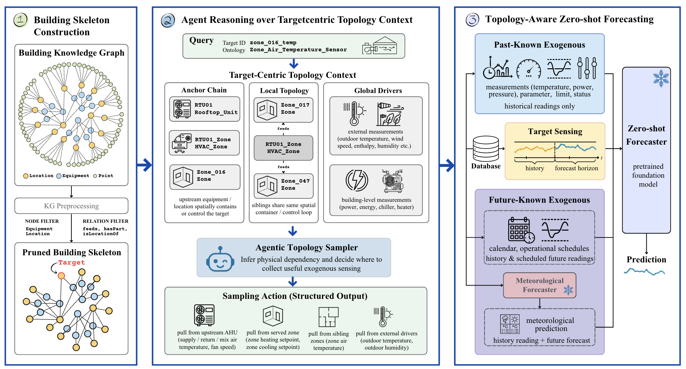

<h1 align="left">TopoBrick: <small>Agentic Topology Sampling of Exogenous Variables for Zero-Shot Building IoT Forecasting</small></h1>

<p align="left">
  <a href="https://arxiv.org/abs/2607.06349"></a>
  
  <a href="#license"></a>
</p>

This repository accompanies the [TopoBrick](https://arxiv.org/abs/2607.06349) paper. TopoBrick is a training-free framework for zero-shot building IoT forecasting. It constructs a compact structural skeleton from a Brick knowledge graph and uses an agentic topology sampler to select target-centric exogenous variables. The selected variables are organized by deployment-time availability, separating past-known sensor states from future-known calendar, schedule, and meteorological inputs. Across three real-world buildings, TopoBrick outperforms strong zero-shot baselines on two of the three and remains competitive with fully trained building-specific models; its gains are concentrated where the routed variables reflect real physical coupling.

## Pipeline

<p align="center">
  
</p>

1. **Building Skeleton Construction:** reduce the Brick knowledge graph to the topology and metadata needed for forecasting.
2. **Target-centric Topology Sampling:** use an agent to select physically relevant exogenous variables for each forecast target.
3. **Zero-shot Forecasting:** separate past-known and future-known inputs and supply the resulting context to a frozen time-series foundation model.

## Setup

Python 3.10 or later is required. A CUDA-capable GPU is recommended for forecasting.

```bash
python -m venv myenv
source myenv/bin/activate
pip install -r requirements.txt
```

## Data

The [LBNL59](https://doi.org/10.7941/D1N33Q) and [BTS](https://github.com/cruiseresearchgroup/DIEF_BTS) time-series datasets are not redistributed. Arrange the source files under `data/raw` as follows:

```text
data/raw/
├── LBNL59/
│   ├── Building_59/
│   │   ├── Bldg59_clean data/*.csv
│   │   └── Bldg59_w_occ Brick model.ttl
│   └── data_description_table_3year_clean_data.xlsx
└── BTS/
    ├── Site_B.ttl
    ├── Site_Baa/*.pickle
    ├── Site_B_metadata.csv
    ├── Site_C.ttl
    ├── Site_Caa/*.pickle
    └── Site_C_metadata.csv
```

`data/` and generated results are ignored by Git. The release includes the Brick ontology in `topobrick/resources/` and compressed topology-sampling outputs in `outputs/subgraphs/`.

## Quick Start

The released sampler outputs allow the paper pipeline to run without an LLM endpoint. Each launcher runs through forecasting by default; `--released-subgraphs` replaces topology construction and agentic sampling with the corresponding released artifact. No separate forecast option is required.

LBNL59:

```bash
./topobrick/scripts/lbnl.sh --released-subgraphs
```

BTS Site B and Site C:

```bash
./topobrick/scripts/bts_b.sh --released-subgraphs
./topobrick/scripts/bts_c.sh --released-subgraphs
```

Each command verifies the released target-centric subgraphs before using them. Results are written under `outputs/forecast/`.

The released protocol uses 15-minute observations, a 96-step lookback, forecast horizons of 24, 48, 72, and 96 steps, all valid test windows, seed 0, and Chronos-2.

### Rerun topology sampling

To rerun the agentic sampler instead of using the released outputs, configure an OpenAI-compatible endpoint and run a launcher without `--released-subgraphs`:

```bash
export OPENAI_BASE_URL="http://127.0.0.1:8000/v1"
export OPENAI_API_KEY="REPLACE_WITH_YOUR_API_KEY"
./topobrick/scripts/lbnl.sh
```

Use `python -m topobrick.run --help` to inspect model and runtime options.

## Repository Structure

```text
TopoBrick/
├── assets/                       README assets
├── configs/                      released dataset configurations
├── outputs/subgraphs/            released topology-sampling outputs
├── topobrick/
│   ├── run.py                    unified pipeline entry point
│   ├── preprocessing/            ingestion and L1-L4 preprocessing
│   ├── sampler/                  graph construction and topology sampling
│   ├── forecast/                 inputs, forecasting, and evaluation
│   ├── baselines/                naive and supervised baselines
│   ├── resources/                bundled Brick ontology
│   ├── scripts/                  dataset launchers
│   └── utils/                    shared utilities
├── requirements.txt              pinned reproduction environment
└── pyproject.toml                package metadata and entry point
```
## Update
🚩 [09/2026] Initial code released for TopoBrick.
## Citation

```bibtex
@inproceedings{lin2026topobrick,
  title     = {TopoBrick: Agentic Topology Sampling of Exogenous Variables for Zero-Shot Building IoT Forecasting},
  author    = {Lin, Xiachong and Yin, Du and Prabowo, Arian and Xue, Hao and Hu, Wen and Razzak, Imran and Amos, Matthew and Behrens, Sam and Salim, Flora D.},
  booktitle = {The 34th ACM International Conference on Advances in Geographic Information Systems (SIGSPATIAL '26)},
  year      = {2026},
  url       = {https://arxiv.org/abs/2607.06349}
}
```

## License

TopoBrick is released under the [MIT License](LICENSE). The bundled Brick ontology retains its upstream BSD-3-Clause license, as recorded in the license file.
